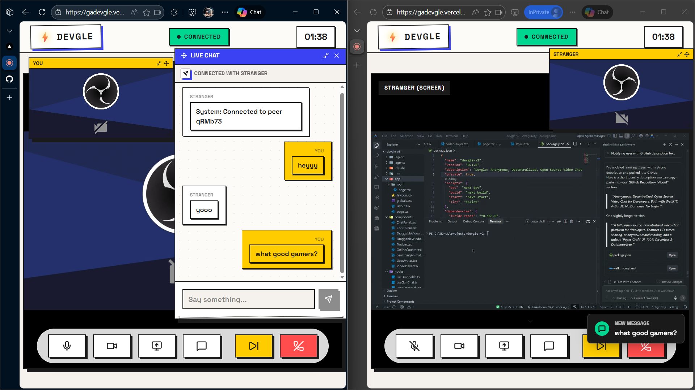

# ⚡ Devgle (v2)

> **"Where Developers Connect, Anonymous & Distraction-Free."**



## 🌟 Introduction

**Devgle** is not just another video chat app. It is a **digital sanctuary for developers**—a "Paper-Craft" themed environment designed to foster genuine connection, anonymous code reviews, and spontaneous debugging sessions.

Built with **privacy**, **aesthetics**, and **performance** in mind, Devgle uses the latest web technologies to deliver a premium experience without the bloat.

## 📢 Developers Assemble!

**This project needs YOU.** 🫵

Devgle is fully open-source because we believe the best tools are built *by* developers, *for* developers. We have the foundation—a beautiful UI, solid WebRTC networking, and a decentralized chat signaling system—but to truly bring this to life, **we need the community.**

Whether you're a React wizard, a WebRTC guru, or a UI/UX enthusiast, there is a place for you here.

**Why Contribute?**
- **Experiment with Modern Tech**: Play with Next.js 14, WebRTC, and GunJS (Decentralized Graph Database).
- **Shape the Product**: Help decide the future features. A code editor? Pair programming whiteboard? You decide.
- **Showcase Your Skills**: Build complex features like peer-to-peer screen sharing and real-time canvas drawing.

## ✨ Key Features

- **🎭 Anonymous Matchmaking**: One-click connection to a random developer peer. No sign-ups, no tracking.
- **📹 HD Video & Audio**: Crystal clear, low-latency streams via native WebRTC.
- **🖥️ Screen Sharing**: Effortless, high-performance screen sharing for live debugging.
- **🎨 Paper-Craft UI**: A unique, calming aesthetic featuring layered elements, glassmorphism, and smooth micro-interactions.
- **📱 Mobile-First Design**:
  - **Auto-Stacking Layouts**: Video feeds adapt perfectly to mobile screens.
  - **Swipeable Controls**: "Zoom-style" touch controls for on-the-go meetings.
- **🔒 Decentralized Chat**: Zero-server chat logic powered by **GunJS** / **Trystero**. Your messages go directly to your peer.
- **🪟 Resizable Widgets**: Customize your view! Resize your local camera or connection preview to fit your workflow.

## 🛠️ Tech Stack

| Domain | Technology |
| :--- | :--- |
| **Framework** | [Next.js 14](https://nextjs.org/) (App Router) |
| **Language** | [TypeScript](https://www.typescriptlang.org/) |
| **Styling** | [Tailwind CSS](https://tailwindcss.com/) + Custom CSS Variables |
| **Real-time** | [WebRTC](https://webrtc.org/) (Peer-to-Peer Media) |
| **Signaling** | [GunJS](https://gun.eco/) / [Trystero](https://github.com/dmotz/trystero) |
| **State** | React Hooks (`useReducer`, `useContext`) |
| **Deployment** | [Vercel](https://vercel.com/) |

## � Getting Started

Ready to code? Follow these steps to get the app running locally.

### Prerequisites
- Node.js 18+
- npm or yarn

### Installation

1.  **Clone the repository**:
    ```bash
    git clone https://github.com/GokulAnand14/devgle.git
    cd devgle
    ```

2.  **Install dependencies**:
    ```bash
    npm install
    # or
    yarn install
    ```

3.  **Run the development server**:
    ```bash
    npm run dev
    ```

4.  **Launch**:
    Open [http://localhost:3000](http://localhost:3000) in your browser.

## 🗺️ Roadmap

We have big plans. Here's what's next (and where you can help!):

- [ ] **Collaborative Code Editor**: Monaco Editor integration for real-time pair programming.
- [ ] **Whiteboard**: A shared canvas for system design discussions.
- [ ] **User Profiles (Optional)**: "Anonymous" doesn't have to mean "Transient". Save your stats locally!
- [ ] **Group Rooms**: Mesh networking for >2 peers.

## 🤝 How to Contribute

1.  **Fork** the repository.
2.  Create a **Feature Branch** (`git checkout -b feature/NewCoolThing`).
3.  **Commit** your changes (`git commit -m 'Add NewCoolThing'`).
4.  **Push** to the branch (`git push origin feature/NewCoolThing`).
5.  Open a **Pull Request**.

## 📄 License

This project is open-source and available under the [MIT License](LICENSE).

---

**Built with ❤️ for the Developer Community.**
